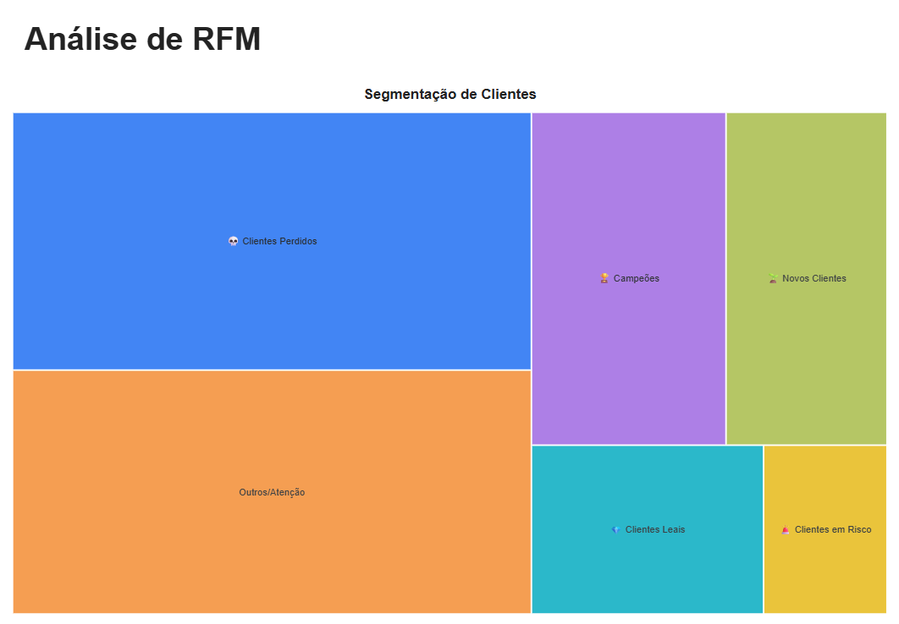
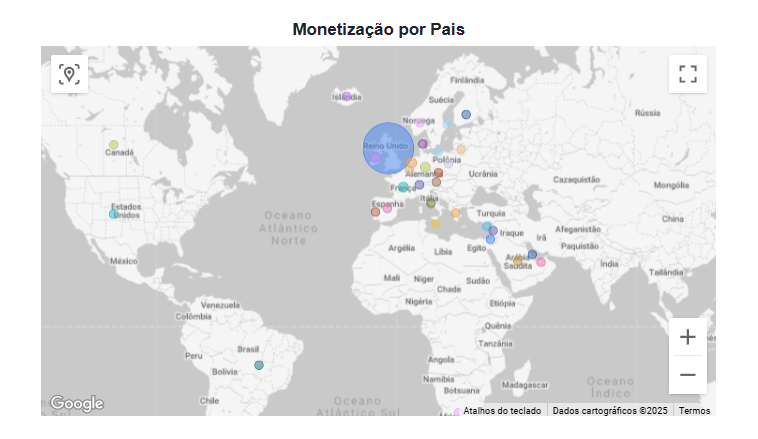
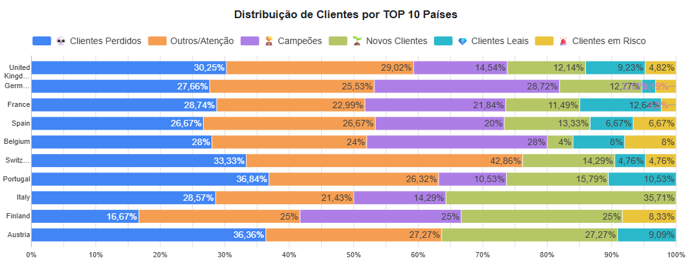
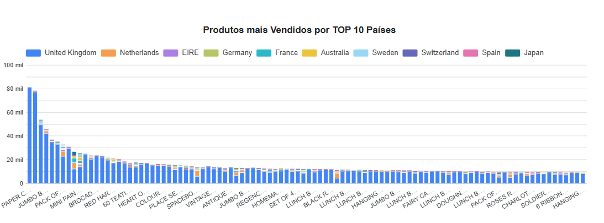
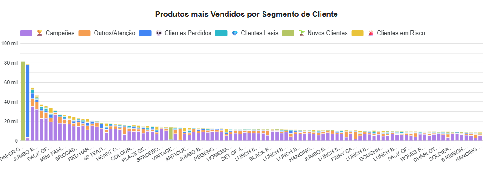

# Otimização da Retenção de Clientes

# PROBLEMA DE NEGOCIO

Uma empresa de e-commerce internacional está enfrentando o desafio de manter seus clientes ativos e aumentar o valor gerado por eles ao longo do tempo (LTV - Lifetime Value). A empresa sabe que adquirir novos clientes é mais caro do que reter os existentes, mas não tem clareza sobre quais clientes são mais valiosos ou quais têm maior probabilidade de "churn" (cancelamento/abandono).

# OBJETIVO DA ANÁLISE

Identificar Padrões de Compra: Entender o que diferencia os clientes de alto valor dos demais (produtos que compram, frequência, valor médio do pedido, país).

# PREMISSAS DA ANÁLISE

Dados hitóricos de compra dos clientes de vários paises em que a empresa atua de 2010 há 2011
Utilização da regra de negócio para clacificar o segmento de cada cliente

# ESTRATEGIA DA SOLUÇAO

#### Limpeza de Dados: Tratar valores nulos e corrigir valores inconsistentes
#### Cálculo do RFM:
Recência (R): Quantos dias faz desde a última compra de cada cliente.
Frequência (F): Total de transações únicas de cada cliente.
Valor Monetário (M): Soma do TotalPrice de cada cliente.
#### Segmentar a Base de Clientes: Utilizar a metodologia RFM (Recência, Frequência, Valor Monetário) para classificar os clientes em grupos estratégicos (por exemplo, "Clientes Leais", "Clientes em Risco", "Novos Clientes").

# HIPOTESES/PERGUNTAS ANALISADAS

#### Qual segmento possui mais clientes?
#### Qual o comportamento dos clientes? Oque precisão fazer para se tornar campeões?
#### Qual País tem mais potencial de monetização?
#### Qual país tem mais campeões?
#### Qual o produto mais consumido por país?
#### Qual o produto mais comprado por segmento?

# SEGMENTAÇÃO RFM

# INSIGTHS DA ANALISE

#### Análise por segmento

1. Campeões: Clientes que estão acostumados a comprar com mais frequência em um curto espaço de tempo com um bom ticket médio - Recompensa e Exclusividade: Enviar ofertas exclusivas, acesso antecipado a novos produtos (acesso VIP) ou descontos de alto valor. Aproveite o Engajamento: Peça por avaliações, depoimentos ou que sejam embaixadores da marca. Eles têm alta probabilidade de responder positivamente.

2. Clientes Fiéis: Clientes que tem o intervalo de compra parecido com campeões, mas precisa aumentar a frequência de compra - Upsell e Cross-sell: Ofereçer produtos complementares (cross-sell) ou versões premium (upsell) com base em compras anteriores. Programa de Fidelidade: Incentive-os a subir de nível no programa de fidelidade para aumentar o gasto médio.

3. Novos Clientes: Clientes que compraram recente e estão conhecendo a empresa, precisão de mais confiança para comprar mais vezes - Onboarding Eficaz: Enviar uma sequência de e-mails de boas-vindas que reforce a decisão de compra e apresente a gama de produtos. Incentivo à 2ª Compra: Ofereçer um cupom com prazo curto para a próxima compra para criar um hábito de repetição. Pesquisa de Satisfação: Solicitar feedback sobre a primeira experiência para garantir uma transição suave para cliente fiel.

4. Outros/Atenção: Clientes com um tempo regular entre uma compra e outra e baixa frequência, porém, tem um bom ticket médio e ainda pode se tornar um campeão com o incentivo certo - Personalização Forte: Use recomendações de produtos altamente personalizadas, baseadas no que eles costumavam comprar. Programa de Fidelidade: Incentive-os a subir de nível no programa de fidelidade para aumentar o gasto médio. Incentivo à 2ª Compra: Ofereçer um cupom com prazo curto para a próxima compra para criar um hábito de repetição.

5. Clientes em Risco: Clientes com um longo período desde a última compra e baixa frequência e um ticket médio intermediário - Campanhas de Reativação: Enviar ofertas de "saudade" com descontos ou frete grátis por tempo limitado, visando reativar a recência. Personalização Forte: Usar recomendações de produtos altamente personalizadas, baseadas no que eles costumavam comprar. Identificar a Causa: Se possível, tentar entender por que o cliente parou de comprar (pesquisa rápida, por exemplo).

6. Clientes Perdidos: Clientes que não compram a muito tempo e não compram com frequência - È preciso estudar se é viável mover ações para fazer com que esses clientes compre novamente, pois para reativá-los pode ter um custo muito alto. Oferta de Última Chance: Enviar uma oferta agressiva (alto desconto) para tentar uma reativação. Se a resposta for zero, considere movê-los para uma lista de exclusão de marketing pago para otimizar o custo de mídia. Exclusão de Listas: Evitar gastar recursos (tempo, dinheiro em anúncios) com quem tem baixíssima chance de retorno. Foque os esforços nos segmentos mais rentáveis.

#### Monetização por Pais

A empresa possui a sua maior força de monetização na Europa, principalmente no Reino Unido.
Mesmo o Reino Unido tendo a maior força possui um déficit grande "Clientes Campeões", assim como os demais países da Europa.
  

#### Produto

O pais que teve mais quantidade e variedade de produtos vendidos também foi o Reino Unido.

Uma observação em relação ao produto mais vendido, o segmento de "Novos Clientes" foi oque mais comprou materiais de escritório.

Já o segmento de "Clientes Perdidos" mais comprou foi um jarro de cerâmica, que seria interessante coletar o feedback sobre esse produto para medir a correlação por ter sido mais comprado por um segmento específico.

Já os "Clientes Campeões" possuem uma grande variedade e quantidade de produtos comprados, mostrando um forte engajamento com os produtos da empresa.

# RESULTADO/ RECOMENDAÇÃO

Após separar os clientes por segmento foi descoberto que a empresa possui um grande número de clientes perdidos, e pouca quantidade de clientes campeões e clientes fiéis, é preciso estudar e fazer ações para que os demais segmentos de clientes comprem mais rápido e com mais frequência aumentando o faturamento da empresa retendo mais clientes.

#### Para os clientes se tornarem "Campeões" eles precisam comprar em média:
#### A cada 11 dias
#### Ter uma frequência acima de 13
#### Com um ticket médio de pelo menos R$590,00
#### E ter um forte engajamento com os demais produtos da empresa

# VISUALISE A ANALISE COMPLETA
https://lookerstudio.google.com/reporting/81e4d2bb-3685-4738-9f27-b87ead450ae3

# Próximos Passos

1. Monitorar a Migração de Segmentos: Acompanhar a taxa com que os clientes de segmentos inferiores (como "Em Risco" ou "Novos") migram para segmentos superiores (como "Fiéis" e "Campeões").
2. Mensurar o ROI: Calcule o Retorno sobre o Investimento (ROI) de cada campanha por segmento. A campanha para um "Campeão" deve ser mais lucrativa do que a campanha para um "Perdido".
3. Refinar os Critérios: Ajuste as pontuações de Recência, Frequência e Valor Monetário se os segmentos não estiverem mais refletindo o comportamento atual do seu negócio. Por exemplo, se a frequência média de compra diminuiu, os critérios de pontuação F devem ser ajustados.
